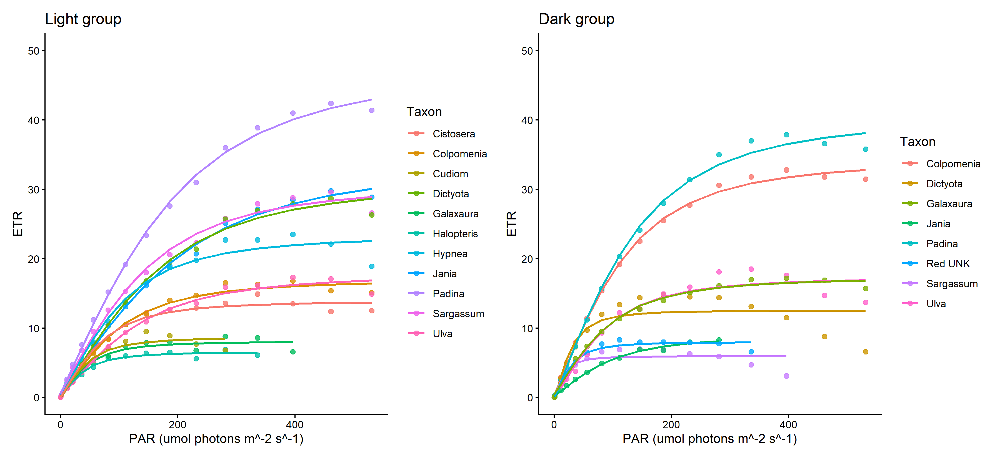
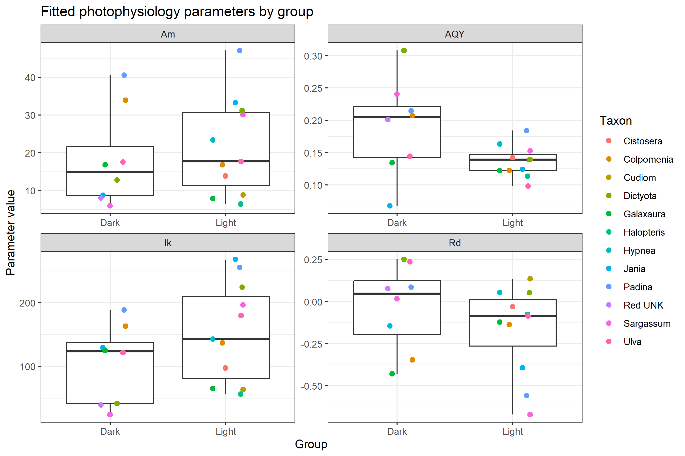
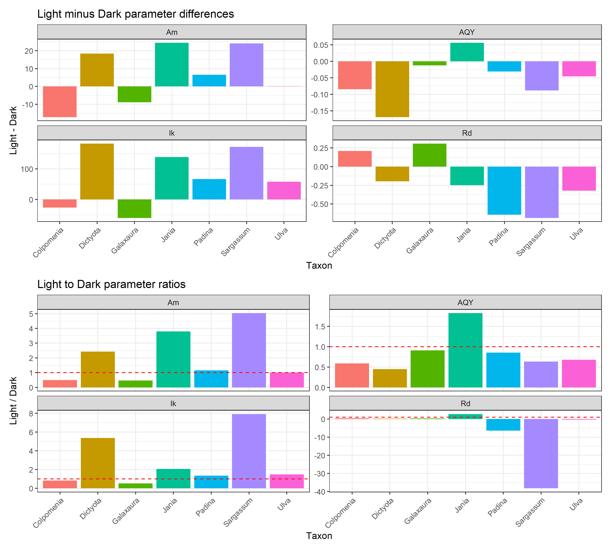
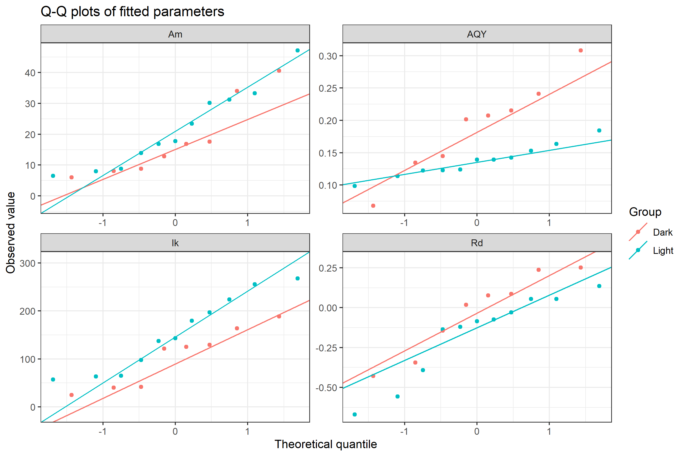

This post documents the photophysiology homework analysis for the research methods course.

## Assignment Goal

The assignment was to analyze the photophysiology data, extract the relevant parameters, organize the results in a tidy format similar to `Mock_Photophysiology_2026.csv`, export tables and figures, and write Materials and Methods, Results, and Interpretation sections.

The raw photophysiology data were provided as two PAM/FIRe-style fluorescence files:

- `light (1).csv`
- `dark (1).csv`

Sample identities and taxa were assigned using `Photophysiology_metadata.csv`.

## Materials and Methods

The data were analyzed in R. The workflow followed the provided example script and used the Light and Dark photophysiology datasets. The raw measurements were recorded on 16 April 2026 according to the date column in the raw files. Each raw file contained PAR steps and fluorescence-derived electron transport rate measurements for multiple samples. ETR columns were reshaped from wide format into long format, then joined with sample metadata.

ETR values equal to zero at PAR values greater than zero were treated as missing values, because the course script explains that these values indicate that a measurement had ended. Light samples `Light_3` and `Light_9` were removed because the provided script identified them as curves that did not reach the expected response shape. No dark samples were removed. The metadata spelling `Galxaura` was corrected to `Galaxaura` in the processed data so paired taxon comparisons could be matched correctly.

For each sample, ETR was fitted as a function of PAR using the model from the course script:

`ETR = Am * ((AQY * PAR) / sqrt(Am^2 + (AQY * PAR)^2)) - Rd`

The extracted parameters were:

| Parameter | Meaning |
|---|---|
| `Am` | Asymptotic maximum ETR, interpreted as maximum photosynthetic electron transport capacity. |
| `AQY` | Initial slope of the curve, interpreted as apparent quantum yield or light-use efficiency. |
| `Rd` | Fitted intercept/respiration-like parameter in ETR units. |
| `Ik` | Saturation irradiance proxy, calculated as `Am / AQY`. |

Only taxa represented in both Light and Dark groups were used for paired Light-Dark comparison. Because sample size was small, plots and effect sizes were emphasized. Paired Wilcoxon signed-rank tests were used as exploratory tests, and p-values were adjusted with the Benjamini-Hochberg method.

The R packages used were:

| Package | Version |
|---|---:|
| dplyr | 1.2.1 |
| tidyr | 1.3.2 |
| lubridate | 1.9.5 |
| hms | 1.1.4 |
| ggplot2 | 4.0.3 |
| purrr | 1.2.2 |
| broom | 1.0.13 |
| patchwork | 1.3.2 |
| openxlsx | 4.2.8.1 |
| knitr | 1.51 |

## Results

### Photosynthesis-Irradiance Curves

**Figure 1.** Photosynthesis-irradiance curves for retained Light and Dark samples. Points show observed ETR values and lines show fitted non-linear curves.

### Summary of Fitted Parameters

The analysis fitted ETR/PAR curves for retained Light and Dark samples and extracted four parameters: `Am`, `AQY`, `Rd`, and `Ik`.

**Figure 2.** Fitted photophysiology parameters in Light and Dark groups. Points represent individual taxa/samples.

| Parameter | Group | n | Mean | SD | Min | Q25 | Median | Q75 | Max |
|---|---|---:|---:|---:|---:|---:|---:|---:|---:|
| AQY | Dark | 8 | 0.1900 | 0.0733 | 0.0679 | 0.1421 | 0.2045 | 0.2215 | 0.3079 |
| AQY | Light | 11 | 0.1366 | 0.0241 | 0.0986 | 0.1226 | 0.1391 | 0.1476 | 0.1841 |
| Am | Dark | 8 | 18.0790 | 12.6512 | 5.9816 | 8.6049 | 14.8339 | 21.6898 | 40.5690 |
| Am | Light | 11 | 21.5221 | 12.7588 | 6.4829 | 11.3566 | 17.7312 | 30.6472 | 47.0819 |
| Ik | Dark | 8 | 104.3842 | 61.3853 | 24.8202 | 41.2207 | 123.4942 | 137.9091 | 188.6494 |
| Ik | Light | 11 | 153.4213 | 77.3773 | 56.9885 | 81.3046 | 143.2214 | 210.5159 | 267.8714 |
| Rd | Dark | 8 | -0.0307 | 0.2531 | -0.4277 | -0.1942 | 0.0475 | 0.1244 | 0.2516 |
| Rd | Light | 11 | -0.1655 | 0.2613 | -0.6701 | -0.2639 | -0.0854 | 0.0122 | 0.1361 |

**Table 1.** Summary statistics for fitted photophysiology parameters by group.

### Paired Light-Dark Comparison

The taxa included in paired comparisons were Colpomenia, Dictyota, Galaxaura, Jania, Padina, Sargassum, and Ulva.

| Parameter | p-value | BH-adjusted p-value |
|---|---:|---:|
| AQY | 0.1083 | 0.2166 |
| Am | 0.2719 | 0.2719 |
| Ik | 0.1083 | 0.2166 |
| Rd | 0.2049 | 0.2719 |

**Table 2.** Paired Wilcoxon tests comparing Light and Dark values for taxa represented in both groups.

**Figure 3.** Paired taxon comparison between Light and Dark groups. The top panels show absolute differences and the bottom panels show ratios.

**Figure 4.** Q-Q plots for fitted parameters.

## Interpretation

The fitted curves produced interpretable parameter estimates for 11 Light samples and 8 Dark samples after two problematic Light curves were removed. Seven taxa were available in both groups and could be used for paired comparison.

The paired Wilcoxon tests did not produce Benjamini-Hochberg adjusted p-values below 0.05 for `Am`, `AQY`, `Rd`, or `Ik`. Therefore, the analysis does not provide strong statistical evidence for a consistent Light-Dark difference in the fitted parameters.

However, this should not be interpreted as proof that no biological differences exist. The sample size is small, and some taxa show large taxon-specific differences in the paired difference and ratio plots. For this dataset, the biological interpretation should rely on the combination of fitted curves, parameter magnitudes, paired differences, and uncertainty caused by small sample size.

The strongest limitations are the small and uneven sample set, the removal of two Light samples, and the fact that only taxa represented in both groups could be used for paired tests. These results should therefore be treated as exploratory evidence for photophysiological patterns among the sampled algae.

## Supporting Files

The supporting files for this post are saved in `photophysiology_homework_2026/`:

- [`photophysiology_homework_2026.Rmd`](../photophysiology_homework_2026/photophysiology_homework_2026.Rmd): reproducible R analysis source.
- [`photophysiology_parameters_tidy.csv`](../photophysiology_homework_2026/outputs/photophysiology_parameters_tidy.csv): tidy parameter table in the requested format.
- [`photophysiology_parameters_with_readme.xlsx`](../photophysiology_homework_2026/outputs/photophysiology_parameters_with_readme.xlsx): Excel table with `Data` and `ReadMe` sheets.
- [`photophysiology_homework_environment.RData`](../photophysiology_homework_2026/outputs/photophysiology_homework_environment.RData): saved R environment.
- [`photophysiology_summary_table.csv`](../photophysiology_homework_2026/outputs/photophysiology_summary_table.csv): exported summary table.
- [`paired_wilcoxon_tests.csv`](../photophysiology_homework_2026/outputs/paired_wilcoxon_tests.csv): exported statistical test table.
- [`paired_taxon_differences.csv`](../photophysiology_homework_2026/outputs/paired_taxon_differences.csv): exported paired taxon differences and ratios.
- [`package_versions.csv`](../photophysiology_homework_2026/outputs/package_versions.csv): package names and versions.
